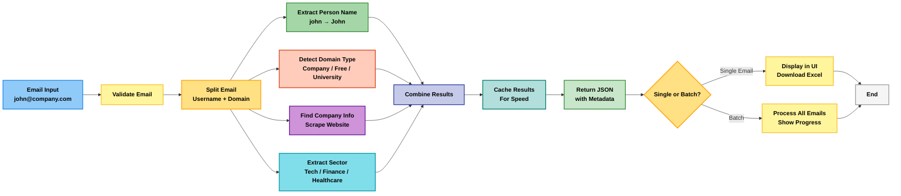

# 🦜 Email Enrichment Engine

---

## 🚀 Overview
a powerful tool that transforms any email address into actionable business intelligence. Designed for professionals, researchers, and marketers, it quickly uncovers valuable insights about people, companies, and industries.

By simply pasting a single email or uploading a CSV/Excel file, you can instantly access:

- 👤 **Person's Name** – Extracted intelligently using multiple NLP and scraping strategies.  
- 🏢 **Company Name** – Identified from the domain or official company website.  
- 💼 **Business Sector** – Classified into Technology, Finance, Healthcare, Retail, and more.  
- 🎓 **University or Free Email Detection** – Separates educational emails from free webmail services.  
- 📊 **Structured Enriched Data** – Delivered in JSON or Excel for easy analysis and reporting.  


Built with **NLP**, **web scraping**, and **machine learning**, this engine makes email enrichment fast, accurate, and reliable—perfect for data-driven decisions.

---

## ✨ Features
- **Single Email Lookup** – Quickly enrich any email with company and person info.
- **Bulk Email Processing** – Upload CSV/Excel to process hundreds of emails at once.
- **Smart Name Parsing** – Extracts names from email addresses intelligently.
- **Company Detection** – Finds the company behind the email domain.
- **University Recognition** – Recognizes educational emails.
- **Industry Classification** – Categorizes companies by sector (Tech, Finance, etc.).
- **Free Email Detection** – Identifies Gmail, Yahoo, Outlook, and other free domains.
- **Excel Export** – Download enriched data for reports or analysis.
- **Real-Time Logs** – See detailed logs of processing steps.

---
## 📝 Step-by-Step Breakdown

### 1️⃣ Email Validation
- Validates the email format using regex pattern matching.

### 2️⃣ Parse Email Components
- Splits the email into `username` and `domain` (e.g., `john.doe` and `company.com`).

### 3️⃣ Extract Person Name (4 strategies, fallback chain)
1. **Strategy 1:** Parse username structure (common patterns like `first.last`, `first_last`).  
2. **Strategy 2:** Use **spaCy NLP** to recognize named entities in the username.  
3. **Strategy 3:** Scrape the company website's team/leadership pages.  
4. **Strategy 4:** Search **DuckDuckGo** for company leadership information.

### 4️⃣ Detect Domain Type (Classification)
- Checks if it’s a known free email provider (Gmail, Yahoo, Outlook, ProtonMail, etc.).  
- If not, uses **GloVe word embeddings** to determine if domain is a university or company.  
- Applies keyword matching and domain suffix rules as fallbacks.

### 5️⃣ Identify University (if applicable)
- Checks against a database of 100+ known universities.  
- Uses keyword patterns (e.g., `.edu`, `.ac.uk`, `.ac.in`).  
- Scrapes websites for university indicators.

### 6️⃣ Find Related Company (if applicable)
- Scrapes the company website to extract official company name.  
- Retrieves meta descriptions and structured data.  
- Falls back to domain-based naming if scraping fails.

### 7️⃣ Classify Business Sector
- Analyzes website content for industry keywords.  
- Categorizes into: Technology, Finance, Healthcare, Retail, Manufacturing, Consulting, Education, Media, Energy, or Real Estate.  
- Uses fallback search if website analysis doesn’t work.

### 8️⃣ Return Enriched Data
- All findings are compiled into a structured **JSON object** with confidence scores.

---

## 🛠️ Tech Stack

- **Core Language:** Python 3.8+  
- **Web Framework:** Streamlit (beautiful, interactive UI)  
- **NLP Engine:** spaCy (named entity recognition)  
- **Machine Learning:** GloVe word embeddings via Gensim (semantic understanding)  
- **Web Scraping:** BeautifulSoup + Requests  
- **Data Processing:** Pandas  
- **Excel Export:** Openpyxl  
- **Domain Analysis:** tldextract  
- **Search Fallback:** DuckDuckGo API

## 📦 What You Get

Each enriched email returns **complete metadata** in a structured JSON format:

```json
{
  "email": "john.doe@techcompany.com",
  "email_domain": "techcompany.com",
  "domain_type": "Company/Business (95% confidence)",
  "likely_person": "John Doe",
  "related_university": "N/A",
  "university_domain": "N/A",
  "related_company": "Tech Company Inc.",
  "company_domain": "techcompany.com",
  "sector": "Technology",
  "confidence": {
    "domain": "High",
    "university": "Low",
    "company": "High"
  }
}
```
## 🧭 Flow Diagram


## 📁 Project Structure
```
email-enrichment-engine/
├── app.py                       # Main Streamlit application
├── email_enricher1.py           # Core enrichment engine
├── person_name_extractor2.py    # NLP name extraction
├── email_validator3.py          # Email validation
├── company_finder4.py           # Company detection
├── sector_extractor5.py         # Sector classification
├── domain_scraper6.py           # Website scraping
├── domain_type_detector7.py     # Domain classification
├── requirements.txt             # Python dependencies
├── README.md                    # Documentation
├── .gitignore                   # Git ignore rules
└── log/                         # Application logs

```

## 🚀 Getting Started

### Prerequisites
- Python 3.8 or higher  
- pip (Python package manager)  
- ~5 minutes of setup time  

### 1️⃣ Clone or Download the Project
```bash
git clone <YOUR_REPOSITORY_URL>
cd email-enrichment-engine

### 2️⃣ Create a Virtual Environment
# Create environment

python -m venv venv
# or if you wanted a anaconda environment 
conda create -p .vnv python==3.10 -y

# Activate it

# On macOS/Linux:
source venv/bin/activate

# On Windows:
venv\Scripts\activate

### 3️⃣ Install Dependencies
pip install -r requirements.txt

### 4️⃣ Download Required NLP Models
# English language model (required)
python -m spacy download en_core_web_sm

# Multilingual model (optional)
python -m spacy download xx_ent_wiki_sm

### 5️⃣ Run the Application
streamlit run app.py
```
Your browser will automatically open at [http://localhost:8501](http://localhost:8501).  
If not, navigate there manually.

---

## 💡 How to Use

### Single Email Enrichment
1. Click the **"Single Email"** tab.  
2. Paste an email address (e.g., `sarah.smith@google.com`).  
3. Click **"Enrich Email"**.  
4. Wait for the magic ✨ (usually 2-5 seconds).  
5. View the results in a clean table.  
6. Click **"Download Enriched Result"** to save as Excel.

### Bulk Email Processing
1. Prepare a CSV or Excel file with an **"Email"** column.  
2. Click the **"Batch Upload"** tab.  
3. Upload your file.  
4. Watch the progress bar as emails are enriched.  
5. View all results in an expandable results table.  
6. Click **"Download Enriched Results"** to save everything as Excel.

### Performance
Single email: 2-5 seconds (network dependent)
Batch processing: 3-5 seconds per email
Cached lookups: <100ms (instant)

## 🎯 Use Cases

- **Sales & Lead Generation:** Quickly qualify leads by identifying company and sector.  
- **HR & Recruiting:** Verify candidate backgrounds and find company affiliations.  
- **Data Enrichment:** Bulk-enrich email lists for CRM systems.  
- **Academic Research:** Classify email domains by institution type.  
- **Email Verification:** Confirm if emails belong to real companies or free services.  
- **Market Analysis:** Analyze which sectors dominate your email list.  

---

## 📞 Support & Contributing

For issues, questions, or feature requests, please refer to the logs first (`log/enrichment_app.log`).  
Most problems can be diagnosed through detailed error messages there.  

---

## 📄 License

[Specify your license here — e.g., MIT, Apache 2.0, etc.]  

---

## 🙏 Acknowledgments

Built with:  
- **spaCy** for NLP excellence  
- **Gensim / GloVe** for semantic understanding  
- **BeautifulSoup** for web scraping reliability  
- **Streamlit** for a beautiful UI without complexity  


